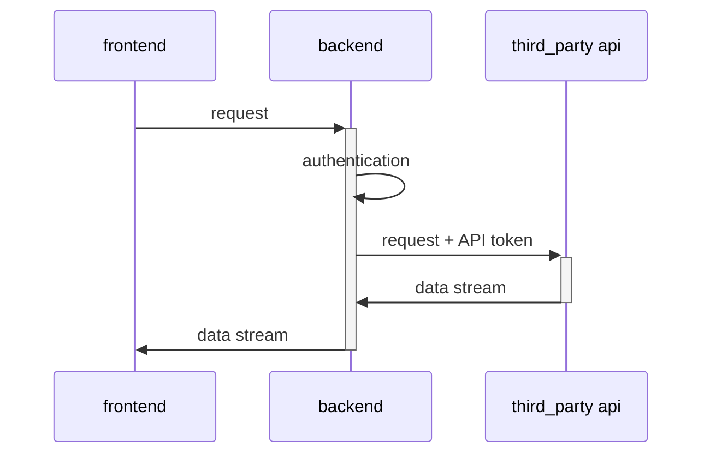
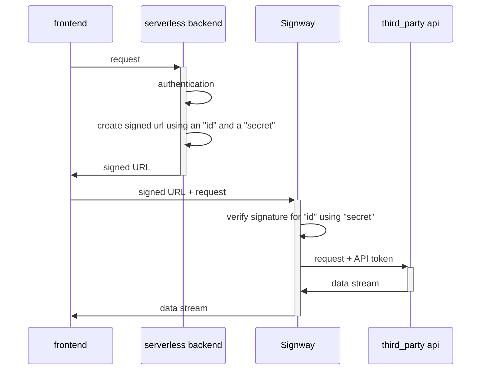

<p align="center">
    
</p>

<p align="center">
    <a href="https://www.signway.io">
        
    </a>
    <a href="https://gabotechs.github.io/signway">
        
    </a>
    
    
</p>

<p align="center">
    Signway is a proxy server that addresses the problem of re-streaming API responses from backend to frontend by allowing the frontend to directly request the API using a pre-signed URL created by Signway. This URL is short-lived, and once it passes verification for authenticity and expiry, Signway will proxy the request to the API and add the necessary authentication headers.
</p>

<p align="center">
    Check the <a href="https://gabotechs.github.io/signway/">docs</a> for more info. If you are looking for the managed version checkout <a href="https://www.signway.io">this link</a>.
</p>

<p align="center">
    
</p>

<p align="center">
    <h1 align="center">Sign your requests and proxy them</h1>
</p>

<table align="center">
    <thead>
        <tr>
            <th>
                <code>Terminal 1</code>: Launch Signway
            </th>
            <th>
                <code>Terminal 2</code>: Create Signed URLs
            </th>
        </tr>
    </thead>
    <tbody>
        <tr>
            <td> 

Export the signing credentials for Signway:

```bash
export SW_ID="app-id"
export SW_SECRET="super-secure-string"
```

Export your OpenAI's API key here:

```bash
export API_KEY="your working token"
```

Launch Signway, ready for accepting requests signed with
`SW_ID` and `SW_SECRET`:

```bash
docker run -p 3000:3000 gabotechs/signway \
$SW_ID \
$SW_SECRET \
--header "Authorization: Bearer $API_KEY"
  
```

Leave Signway running in this terminal...
<br/>
<br/>
<br/>
<br/>
<br/>
<br/>
<br/>
<br/>
<br/>
<br/>
<br/>
<br/>
<br/>
<br/>
<br/>
<br/>
<br/>

</td><td>

👈 Export the same credentials:

```bash
export SW_ID="app-id"
export SW_SECRET="super-secure-string"
```
Install Signway's Python sdk:

```bash
python3 -m venv venv
source venv/bin/activate
pip install signway-sdk
```

Make a script for creating signed URLs:

```python
cat << 'EOF' > sign.py
from signway_sdk import sign_url
import os

print(sign_url(
  os.environ['SW_ID'],
  os.environ['SW_SECRET'],
  "http://localhost:3000",
  "https://api.openai.com/v1/completions",
  10,  # <- URL expiration time in s
  "POST"
))
EOF
```

Make a request to the generated signed URL, as if it was OpenAI:

```bash
curl $(python sign.py) \
-H "Content-Type: application/json" \
-d '{
  "model": "text-davinci-003",
  "stream": true,
  "prompt": "Say this is a test"
}'
```
</td></tr></tbody></table>

# What does it solve?

Imagine that you have a setup that looks like this. Your backend accesses
a public and authenticated api using an API token, and the response needs 
to be streamed in chunks, because it is a lot of data or because the response
uses [SSE](https://www.w3schools.com/html/html5_serversentevents.asp).



As you own the backend, you can safely configure there any api tokens needed for
authenticating against the third party API, and re-stream back the data
as it comes to the end user.

However, if you are using a **serverless** architecture, this gets **tricky** for two
reasons:
1. Most serverless setups, like [AWS lamda](https://aws.amazon.com/lambda/) with [API Gateway](https://aws.amazon.com/api-gateway/),
**don't allow you to stream the response**, you can only send back one final blob.
2. Your serverless function would need to live for a very long time, even if it is just
doing slow IO data transfer, so **cost may increase significantly**.

This is where Signway enters the game. Signway provides you a way of letting the
end user do the request "almost directly" to the third party API in a secure way
without the need of leaking credentials.

The schema using Signway looks like this:



This way you leverage heavy IO work to Signway, which is a high performant gateway server
written in Rust prepared for heavy throughput, and you are able to stream data to end users
from APIs that send you data chunk by chunk.

# Signing algorithm

The signing algorithm is inspired strongly by [AWS signature v4](https://docs.aws.amazon.com/AmazonS3/latest/API/sig-v4-authenticating-requests.html),
the same that [s3](https://docs.aws.amazon.com/AmazonS3/latest/userguide/ShareObjectPreSignedURL.html)
uses for generating pre-signed URLs for letting clients interact with buckets directly.

Generating a signed URL requires that the signer (usually an application's backend) knows a public `id` and a private `secret`. 
The `id` will live in plain text in the signed URL, and the `secret` will be used for creating the request's
signature, but it is not included in the URL.

Signway, who knows which `secret` is associated to which `id`, will take the request and
recalculate its signature. If the declared signature and the calculated one match, and the request has not expired,
it will redirect the request to the specified third party API, adding any preconfigured headers for that `id`, like API tokens.


# Usage

The server is meant to be used with docker, there are public images with support for
`linux/arm64` and `linux/amd64`.

```shell
docker run gabotechs/signway my-id my-secret
```

You can also declare the headers that will be automatically added to the proxy-ed request in case
of an authentic signed request is received:

```shell
docker run gabotechs/signway my-id my-secret -h 'Authorization:Bearer my-secret-token'
```

# Pre-signed URL generation

Typically, the Signway server will be publicly accessible to the internet, prepared
to accept requests with a pre-signed URL, but someone needs to create those pre-signed URLs. This
should be a trusted source, as it needs to know the signing `secret`, like an application's backend.

There is support for generating Signway pre-signed URLs for the following languages:
- [Python](https://github.com/gabotechs/signway-python-sdk)
- [JavaScript](https://github.com/gabotechs/signway-js-sdk)

In order to generate a pre-signed URL, knowing the `id` and the `secret` that
Signway is expecting is necessary, and as the `secret` is private, it is important
to be careful not to leak it.
